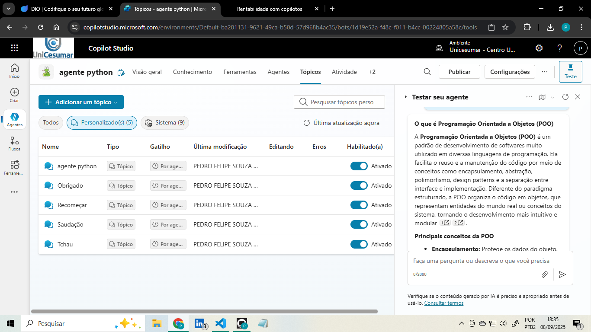
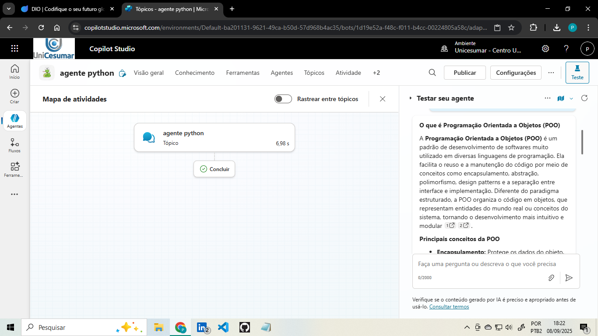
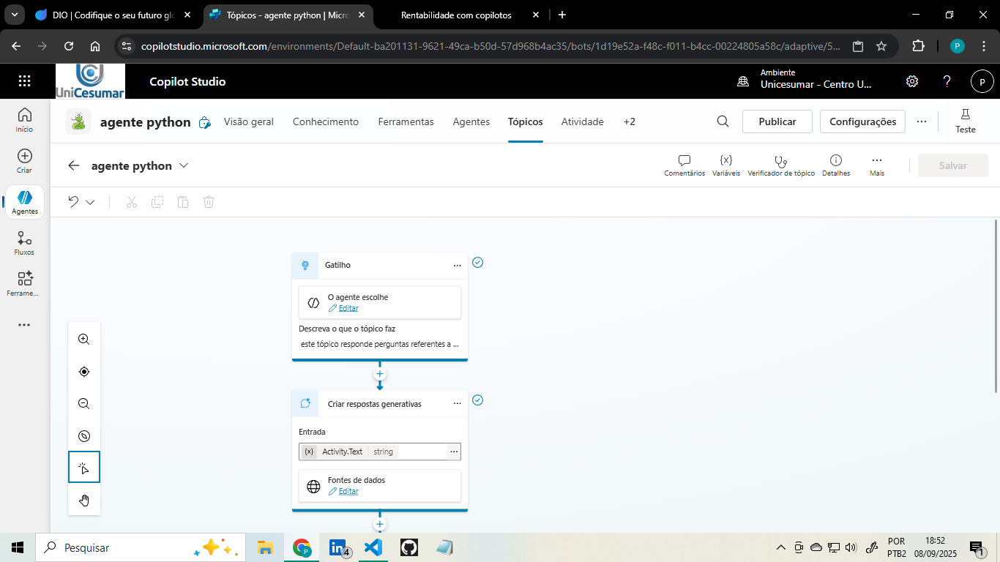

# Projeto: Copiloto sobre Python no Microsoft Copilot Studio

##  Descrição
Este projeto foi desenvolvido como parte do bootcamp **Suzano - DIO**, com o objetivo de criar um **Copiloto no Microsoft Copilot Studio** utilizando um fluxo de conversa personalizado.

O copiloto criado tem como finalidade responder perguntas sobre **Python**, fornecendo explicações técnicas e conceitos básicos da linguagem de programação.

---

##  Configuração do Copiloto
- **Tópico principal criado:** `agente python`
- **Base de conhecimento:** Documentação oficial do Python.
- **Configuração de IA:** Desabilitei a opção de o copiloto usar seus próprios conhecimentos, garantindo que as respostas viessem apenas da base definida.
- **Configuração do copiloto:** Sempre explicar de forma amigavel e dinamica, com exemplos.

---

##  Observações
Durante o desenvolvimento, percebi que o **Microsoft Copilot Studio** passou por uma evolução significativa em relação às aulas gravadas em 2024.  
A interface e algumas opções de configuração estão mais modernas e organizadas, mostrando a constante atualização da ferramenta.

---

##  Aprendizado
Este desafio permitiu praticar:
- A criação de copilotos personalizados.
- A configuração de fluxos de conversa.
- A utilização de uma base de conhecimento específica.
- A análise da evolução do Copilot Studio entre a versão mostrada nas aulas e a versão atual.

---

## Prints do projeto

